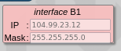
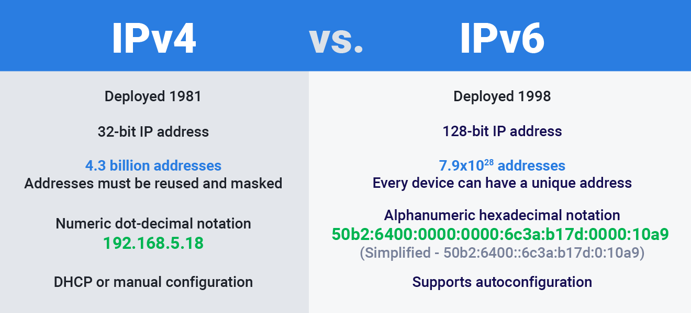
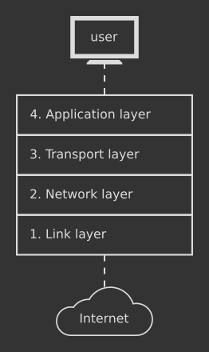
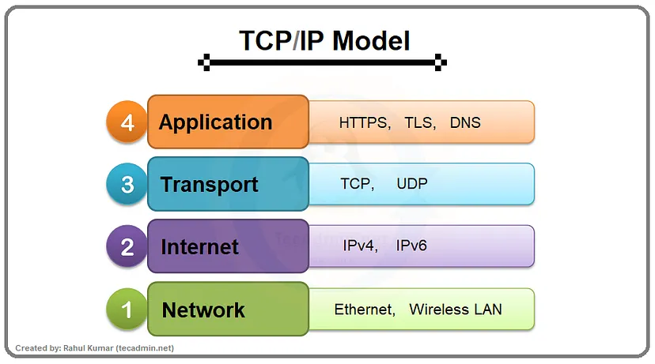
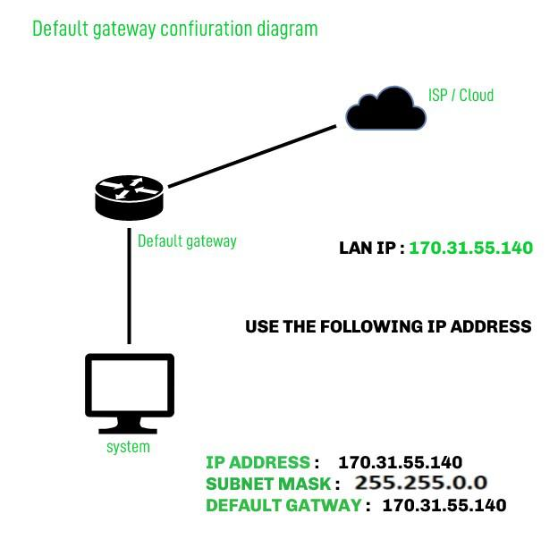
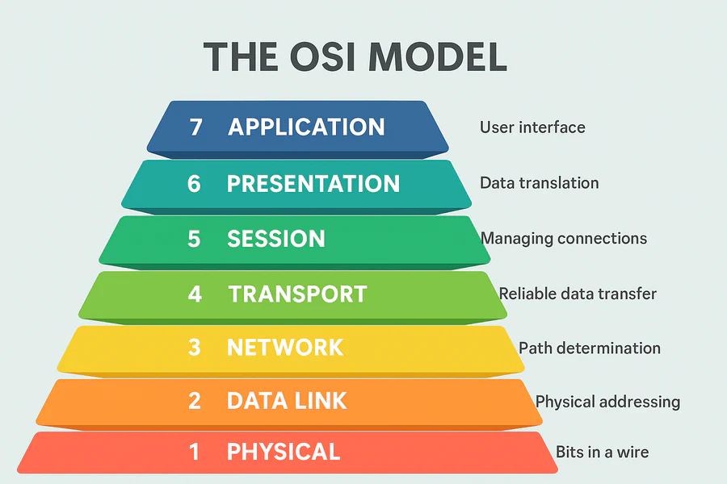
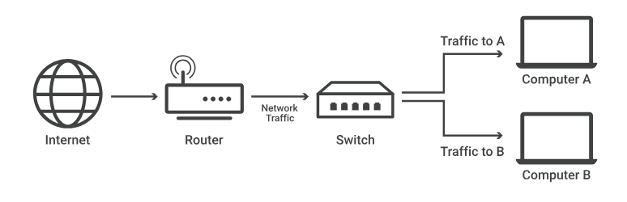
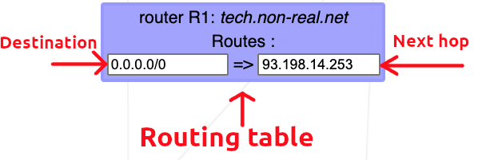

*This project has been created as part of the 42 curriculum by roandrie*

<p align="center">
  
</p>
<h3 align="center">
  <em>Discover the basics of networking</em>
</h3>

---

<div align="center">
  
  
</div>

## ⚠️ Disclaimer

- **Full Portfolio:** This repository focuses on this specific project. You can find my entire 42 curriculum 👉 [here](https://github.com/Overtekk/42).
- **Subject Rules:** I strictly follow the rules regarding 42 subjects; I cannot share the PDFs, but I explain the concepts in this README.
- **Archive State:** The code is preserved exactly as it was during evaluation (graded state). I do not update it, so you can see my progress and mistakes from that time.
- **Academic Integrity:** I encourage you to try the project yourself first. Use this repo only as a reference, not for copy-pasting. Be patient, you will succeed.

---

## 📂 Description

This project is an introduction to the basics of computer networking. We use a local web server to complete 10 exercises. Each exercise teaches fundamental concepts, such as configuring IP addresses, connecting devices through a router, and understanding the role of a default gateway within a network.

---

## 💡 Instructions

To launch the exercice download the `net_practice.tgz` package **(only available for 42 student)**.\
One done, run the file `run.sh` using:
```bash
./run.sh
```
It will launch the web server using your default browser.

You can do two things.

- **Training**: Section to discover the world of computer networking and exercices to do. There are 10 exercices to subit.\
First thing first, enter your intranet login.\
Then, you will have to do the exercice (more of that later).\
You can click on `Check again` to check your current progression (errors, finished).\
`Get my config` give you the download to your configuration. This is needed for submission.\
If you have completed the level, click on the `Next level` button.

- **Evaluation**: This section is for the evaluation. Three randoms levels from 6 to 10 will be offered to be solved in 15 minutes.\
Then, it's all the same from above.

---

## 📥 Submission details

To submit this project, you must export your configuration for all 10 levels using the `Get my config` button.
You must place these 10 exported configuration files (one file per level) directly at the root of your Git repository

---

## 📝 Explanations of concepts

### IP: Network Layer

**Internet Protocol** or **Internet Protocol Adress**

</br>
<p align="center">
	
</p>
</br>

An IP address is a **unique identifying number** assigned to every device connected to a network. It serves as a numeric label that allows devices to communicate over the internet or local networks.
It defines a suite of rules for routing and addressing data packets so they can travel across networks and arrive at the correct destination.

An IP address has two main parts:

1. Network ID: Identifies the specific network the device belongs to.

2. Host ID: Identifies the specific device (node) on that network. TCP/IP uses a subnet mask to separate these two parts.

There are two important types of IP address:

- **Static IP address**: Remains permanent and doesn't change. Used for critical infrastructure like servers or routers.
- **Dynamic IP address**: Changes occasionally. Assigned dynamically by a Dynamic Host Configuration Protocol (DHCP) server, typically used for consumer equipment such as computers and smartphones.

### **IP addresses come in 2 versions:**

## IPv4 vs IPv6

</br>
<p align="center">
	<a href="https://www.avg.com/fr/signal/ipv4-vs-ipv6">
	
	</a>
</p>
</br>

**Internet Protocol version 4** defines an IP address as a 32-bit number and dot-decimal notation. Deployed in the 1981, it has over 4.3 billion addresses. Because of that, addresses must be reused and masked and must be configured manually./
However, because of the growth of the Internet and the depletion of available IPv4 addresses, a new version of IP as be created.

**Internet Protocol version 6** use 128 bits for the IP address and was standardized in 1998. It has over 340 undecillion addresses, so every device can have it's unique IP address, support auto-configuration and has alphanumeric hexadecimal notation.

### **Only IPv4 addresses are used in NetPractice.**

<br>

## Public IP vs Private IP

- **Public IP**: Can be accessed directly over the internet. It is assigned to your network router by your Internet Service Provider (ISP).

- **Private IP** address that your network router assigns to your device. Each device within the same network is assigned a unique private IP address (sometines, also called a private network address). This is how devices on the same internal network talk to each other./
When a network is connected to the internet, it cannot use an IP address from the reserved private IP addresses. The following ranges are reserved for private IP addresses.

```
192.168.0.0 – 192.168.255.255 (65,536 IP addresses)
172.16.0.0 – 172.31.255.255   (1,048,576 IP addresses)
10.0.0.0 – 10.255.255.255     (16,777,216 IP addresses)
```

## Computer reading

While we read IPv4 addresses in a **dot-decimal notation** (like `192.168.1.15`), computers and routers process them entirely in **binary** (0 and 1).

An IPv4 address is exactly **32 bits** long. These 32 bits are divided into 4 sections called **octets** (because each section contains exactly 8 bits) separated by dots.

Each of the 8 bits in an octet represents a power of 2, reading from left to right:
`128 | 64 | 32 | 16 | 8 | 4 | 2 | 1`

To convert a binary octet to a decimal number, you simply add the values of the positions where there is a `1`.

**Example with the IP `192.168.1.15`:**
- **192** -> `11000000` *(128 + 64)*
- **168** -> `10101000` *(128 + 32 + 8)*
- **1**   -> `00000001` *(1)*
- **15**  -> `00001111` *(8 + 4 + 2 + 1)*

Therefore, the computer actually sees `192.168.1.15` as:
`11000000.10101000.00000001.00001111`

Understanding this binary structure is crucial for calculating **Subnet Masks**. Network hardware uses a mathematical process called a "bitwise AND" operation between the binary IP address and the binary Subnet Mask to determine exactly where the Network ID ends and the Host ID begins.

## IPv4 Validity Limits

Since an IPv4 address is made of 4 octets, and each octet is 8 bits long in binary, the decimal value of each octet has a strict mathematical limit.\
The lowest possible value is `0` (binary `00000000`) and the highest possible value is `255` (binary `11111111`).
If any number in an IP address is greater than 255 (e.g., `104.93.23.268`), the address is fundamentally invalid and the network configuration will fail.

## Ipv4 Rules

Depending on the hardware linking two devices, the addressing rules change:

1. **Direct connection or via a Switch (Layer 2):** Two devices can only communicate if they belong to the **exact same subnet**. This means their IP addresses must have the exact same Network ID as defined by their Subnet Mask.
2. **Via a Router (Layer 3):** If two devices have different Network IDs (different subnets), they cannot communicate directly. Their traffic must be sent to a Router (their Default Gateway), which will forward the packet to the correct destination.

### Reserved Addresses: Network and Broadcast

In any given subnet, you cannot use all the available IP addresses for your hosts (computers, router interfaces). Two addresses are always reserved by the system:

- **The Network Address:** This is the very first IP of the subnet (all host bits are set to `0` in binary). It identifies the network itself.
- **The Broadcast Address:** This is the very last IP of the subnet (all host bits are set to `1` in binary). It is used to send a packet to all devices on that specific subnet simultaneously.

**Example for the subnet `192.168.1.0` with a mask of `255.255.255.0`:**
- `192.168.1.0` is the Network Address (Cannot be assigned to a host).
- `192.168.1.1` to `192.168.1.254` are valid Host IPs.
- `192.168.1.255` is the Broadcast Address (Cannot be assigned to a host).

### CIDR Notation (Slash Notation)

Instead of writing the full subnet mask like `255.255.255.0`, networking often uses **CIDR (Classless Inter-Domain Routing)** notation. It simply counts the number of `1`s in the binary version of the subnet mask.

- `255.0.0.0` = 8 bits set to 1 = **`/8`**
- `255.255.0.0` = 16 bits set to 1 = **`/16`**
- `255.255.255.0` = 24 bits set to 1 = **`/24`**

You will often see routing tables using formats like `10.0.0.0/8`. The `/0` seen in default routes (`0.0.0.0/0`) means zero bits are checked, meaning it matches absolutely every IP address.


### TCP: Transport Layer

**Transmission Control Protocol** *(protocole de contrôle des transmissions).

</br>
<p align="center">
	<a href="https://github.com/lpaube/NetPractice/blob/main/img/tcp-ip-stack.png">
	
	</a>
</p>
</br>

It's a communication norm that allow application programs and devices to exchanges messages over a network. It's use to send packets across the internet.

It guarantees the integrity of the data being communicated over a network. Before it transmits data, TCP establishes a connection between a source and its destination, which remains active until communication begins. It then breaks large amounts of data into smaller packets, while ensuring end-to-end delivery without loss of any data.

### TCP/IP

**Transmission Control Protocol/Internet Protocol**

</br>
<p align="center">
	<a href="https://medium.com/@kamlesh140501/understanding-tcp-ip-the-hackers-guide-to-mastering-the-network-5dc60ec36249">
	
	</a>
</p>
</br>

TCP/IP is the foundational suite of communication protocols used to interconnect network devices on the internet.

The difference between TCP and IP is that those are two separate computer network protocols. **IP** is the part that obtains the address which the data is sent to, while **TCP** is the part that is responsible for data delivery once that IP address has been found.

It simplifies the networking process into four distinct layers:

1. Network Access / Link Layer: Handles the physical hardware connections (Ethernet, Wi-Fi).
2. Internet Layer: Handles routing and IP addressing (Where does the packet go?).
3. Transport Layer: Provides reliable data transfer (TCP or UDP).
4. Application Layer: What the user interacts with (HTTP, FTP, SMTP).

### Subnet masks

</br>
<p align="center">
	
</p>
</br>

A subnet mask is a 32-bit number used to differentiate the **Network ID** from the **Host ID** within an IP address./
Where the subnet mask has `255`, the corresponding part of the IP address represents the network. Where the subnet mask has `0`, it represents the specific host.

Example:
For an IP `192.168.1.15` with a mask of `255.255.255.0`, the network is `192.168.1.0` and the host is `15`.
Two devices can only communicate directly without a router if they are on the exact same subnet.

### Default gateways

</br>
<p align="center">
	<a href="https://www.geeksforgeeks.org/computer-networks/default-gateway-in-networking/">
	
</a>
</p>
</br>

A default gateway is the node (usually a router) in a computer network that serves as the forwarding host to other networks. If a device needs to send a packet to an IP address that is outside its own local subnet, it must send it to its default gateway.

Example:
Your home internet box acts as the default gateway for your personal computer.

### OSI layers

</br>
<p align="center">
	<a href="https://www.network-supply.com/blogs/knowledge/the-osi-model-explained">
	
</a>
</p>
</br>

**Open Systems Interconnection**

The OSI model is a conceptual framework used to describe the functions of a networking system. It contains 7 layers, compared to TCP/IP's 4 layers. For this project, we focus mainly on:

- **Layer 2 (Data Link)**: Where Switches operate. It handles data transfer between nodes on the same local network using MAC addresses.

- **Layer 3 (Network)**: Where Routers operate. It handles data routing between different networks using IP addresses.

### Switches & Routers

</br>
<p align="center">
	<a href="https://www.cloudflare.com/fr-fr/learning/network-layer/what-is-a-network-switch/">
	
</a>
</p>
</br>

A switch is a **Layer 2** device. It connects multiple devices together within the same local area network (LAN). Unlike a router, a switch does not understand IP addresses. It forwards data only to the specific device that needs it within the local subnet, making local communication highly efficient.

<br>

A router is a **Layer 3** device. Its primary job is to connect multiple different networks together and route data packets between them based on their destination IP addresses. A router has multiple interfaces, each configured with an IP address belonging to a different subnet. It uses a **Routing Table** to determine the best path for forwarding packets.

### Routing Table

</br>
<p align="center">
	<a href="https://github.com/lpaube/NetPractice/blob/main/img/routing_table1.png?raw=true">
	
</a>
</p>
</br>

A routing table is a data table stored in a router or a network host that lists the routes to particular network destinations. In NetPractice, the routing table consists of 2 elements:

- **Destination**: The destination specifies a network address on which a host is the end target of the packets. The route of `default` or `0.0.0.0/0`, is the route that takes effect when no other route is available for an IP destination address. The default route will use the next-hop address to send the packets on their way without giving a specific destination. The default route will match any network.

- **Next hop**: The next hop refers to the next closest router a packet can go through. It is the IP address of the next router on the packet's way. Every single router maintains its routing table with a next hop address.


---

## 📚 Resources

### General documentation
| Resource | Description |
| :------: | :---------: |
| [Github of lpaube](https://github.com/lpaube/NetPractice) | General explanations of the project |
| [Medium - NetPractice Guide](https://medium.com/@imyzf/netpractice-2d2b39b6cf0a) | General explanations of the project |
| [Github of caroldaniel](https://github.com/caroldaniel/42sp-cursus-netpractice) | General explanations of the project |

### Documentation TCP/IP addressing
| Resource | Description |
| :------: | :---------: |
| [IBM](https://www.ibm.com/docs/en/aix/7.3.0?topic=protocol-tcpip-addressing) | Brief topic of what is TCP/IP addressing |
| [Fortinet (french)](https://www.fortinet.com/fr/resources/cyberglossary/tcp-ip) | Explanation |

### Documentation about Ipv4 / Ipv6
| Resource | Description |
| :------: | :---------: |
| [AVG - Difference between Ipv4/Ipv6 (french)](https://www.avg.com/fr/signal/ipv4-vs-ipv6) | Difference between Ipv4 and Ipv6 protocol |

### Documentation about Default Gateway

| Resource | Description |
| :------: | :---------: |
| [Geeksforgeeks - Default gateway](https://www.geeksforgeeks.org/computer-networks/default-gateway-in-networking/) | General explanation of the role of a default gateway in networking |

### Documentation about OSI Layers

| Resource | Description |
| :------: | :---------: |
| [Network-Supply - OSI Layers](https://www.network-supply.com/blogs/knowledge/the-osi-model-explained) | Explanation of all layers |

### Documentation about Routers and Switches

| Resource | Description |
| :------: | :---------: |
| [Cloudfare - What is a switch](https://www.cloudflare.com/fr-fr/learning/network-layer/what-is-a-network-switch/) | Explanation of switch and router |

### IA was use to:
- **README checker** - check that the informations and clear, relevant and help me correct syntax.

---
